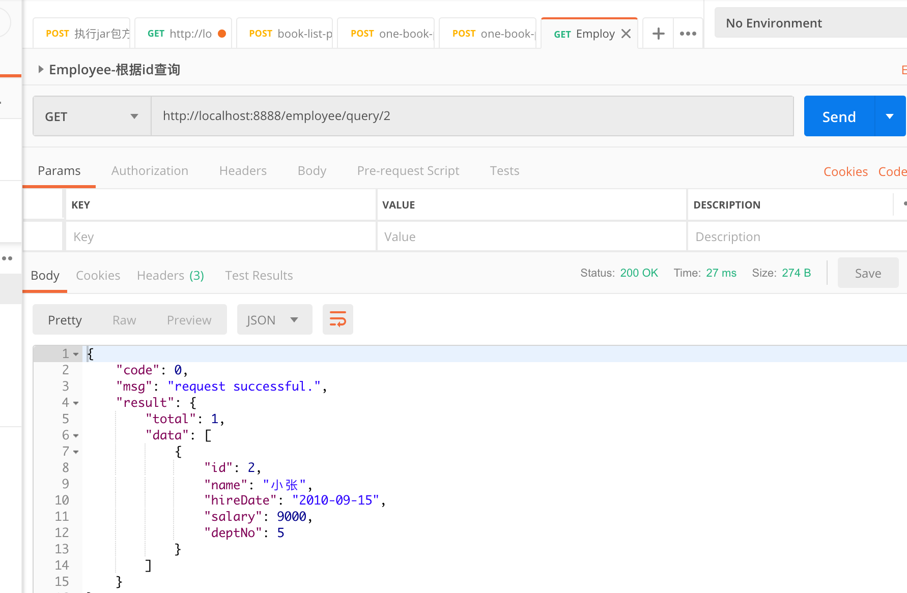

# SpringBoot 学习笔记 10 - 集成数据库


## 1. 添加依赖

```xml
        <dependency>
            <groupId>mysql</groupId>
            <artifactId>mysql-connector-java</artifactId>
            <version>${mysql.version}</version>
        </dependency>

        <dependency>
            <groupId>org.mybatis.spring.boot</groupId>
            <artifactId>mybatis-spring-boot-starter</artifactId>
            <version>${mybatis.version}</version>
        </dependency>
```


## 2. 添加数据库配置

```yaml
spring:
  datasource:
    url: jdbc:mysql://localhost:3306/springbootdemo
    username: bearyang
    password: 123456
mybatis:
  mapper-locations: classpath:mapper/*.xml
```


## 3. 实现java代码

首先创建数据库相关信息：

```mysql
-- create database
CREATE DATABASE springbootdemo;

-- create table
CREATE TABLE EMPLOYEE (
    ID INT UNSIGNED AUTO_INCREMENT,
    NAME VARCHAR(100) NOT NULL,
    HIRE_DATE DATE,
    SALARY DECIMAL(10,2),
    DEPT_NO INT(2),
    PRIMARY KEY (ID)
);

-- insert data
INSERT INTO EMPLOYEE (NAME, HIRE_DATE, SALARY, DEPT_NO) VALUES ('小杨', '2010-09-14', 8000.0, '06');
INSERT INTO EMPLOYEE (NAME, HIRE_DATE, SALARY, DEPT_NO) VALUES ('小张', '2010-09-15', 9000.0, '05');

```

### 3.1 实体类

```java
package com.example.demo.entity;

public class Employee {
    private Integer id;
    private String name;
    private String hireDate;
    private Float salary;
    private Integer deptNo;
    // 省略 getter and setter
}
```

### 3.2 DAO代码

java 代码：

```java
package com.example.demo.dao;

import com.example.demo.entity.EmployeeEntity;
import org.apache.ibatis.annotations.Mapper;

import java.util.List;

@Mapper
public interface IEmployeeDao {

    Integer add(EmployeeEntity employeeEntity);

    Integer delete(Integer id);

    void update(EmployeeEntity employeeEntity);

    EmployeeEntity findEmployeeById(Integer id);

    List<EmployeeEntity> selectAll();
}

```

对应xml：

```xml
<?xml version="1.0" encoding="UTF-8"?>
<!DOCTYPE mapper PUBLIC "-//mybatis.org//DTD Mapper 3.0//EN" "http://mybatis.org/dtd/mybatis-3-mapper.dtd">
<mapper namespace="com.example.demo.dao.IEmployeeDao">

    <resultMap id="EmployeeResultMap" type="com.example.demo.entity.EmployeeEntity">
        <result column="ID" jdbcType="INTEGER" property="id"/>
        <result column="NAME" jdbcType="VARCHAR" property="name"/>
        <result column="HIRE_DATE" jdbcType="DATE" property="hireDate"/>
        <result column="SALARY" jdbcType="DECIMAL" property="salary"/>
        <result column="DEPT_NO" jdbcType="INTEGER" property="deptNo"/>
    </resultMap>

    <insert id="add" parameterType="com.example.demo.entity.EmployeeEntity">
        INSERT INTO EMPLOYEE (ID, NAME, HIRE_DATE, SALARY, DEPT_NO)
            VALUES (#{id}, #{name}, #{hireDate}, #{salary}, #{deptNo})
    </insert>

    <delete id="delete" parameterType="INTEGER">
        DELETE FROM EMPLOYEE WHERE ID = #{id}
    </delete>

    <update id="update" parameterType="com.example.demo.entity.EmployeeEntity">
        UPDATE EMPLOYEE SET
            NAME=#{name}, HIRE_DATE=#{hireDate}, SALARY=#{salary}, DEPT_NO=#{deptNo}
        WHERE ID = #{id}
    </update>

    <select id="findEmployeeById" resultMap="EmployeeResultMap">
        SELECT ID, NAME, HIRE_DATE, SALARY, DEPT_NO FROM EMPLOYEE
            WHERE ID = #{id}
    </select>

    <select id="selectAll" resultMap="EmployeeResultMap">
        SELECT * FROM EMPLOYEE
    </select>

</mapper>
```

其中，名称为EmployeeResultMap的resultMap，作用是将数据库表的字段和java实体类的属性映射起来，在下边的查询语句中，可以直接使用resultMap="xxx"，即可实现返回结果为实体类的类型。

### 3.3 接口相关代码

IService:

```java
package com.example.demo.service;

import com.example.demo.entity.EmployeeEntity;

import java.util.List;

/**
 * @author youngbear
 * @email youngbear@aliyun.com
 * @date 2019-07-21 18:44
 * @blog https://blog.csdn.net/next_second
 * @github https://github.com/YoungBear
 * @description
 */
public interface IEmployeeService {

    /**
     * 添加一个 Employee
     * @param employeeEntity
     * @return 1-添加成功
     */
    Integer addEmployee(EmployeeEntity employeeEntity);

    /**
     * 根据 id 删除一个 Employee
     * @param id
     * @return 1-删除成功
     */
    Integer deleteEmployee(Integer id);

    /**
     * 更新一个 Employee
     * @param employeeEntity
     * @return 更新成功后的结果
     */
    EmployeeEntity updateEmployee(EmployeeEntity employeeEntity);

    /**
     * 根据 id 查询 Employee
     * @param id
     * @return
     */
    EmployeeEntity queryEmployee(Integer id);

    /**
     * 查询所有 Employee
     * @return
     */
    List<EmployeeEntity> selectAll();

}


```

ServiceImpl:

```java
package com.example.demo.service.impl;

import com.example.demo.dao.IEmployeeDao;
import com.example.demo.entity.EmployeeEntity;
import com.example.demo.service.IEmployeeService;
import org.springframework.beans.factory.annotation.Autowired;
import org.springframework.stereotype.Service;

import java.util.List;

/**
 * @author youngbear
 * @email youngbear@aliyun.com
 * @date 2019-07-21 18:44
 * @blog https://blog.csdn.net/next_second
 * @github https://github.com/YoungBear
 * @description
 */
@Service
public class EmployeeServiceImpl implements IEmployeeService {

    @Autowired
    private IEmployeeDao employeeDao;

    @Override
    public Integer addEmployee(EmployeeEntity employeeEntity) {
        return employeeDao.add(employeeEntity);
    }

    @Override
    public Integer deleteEmployee(Integer id) {
        return employeeDao.delete(id);
    }

    @Override
    public EmployeeEntity updateEmployee(EmployeeEntity employeeEntity) {
        employeeDao.update(employeeEntity);
        return employeeDao.findEmployeeById(employeeEntity.getId());
    }

    @Override
    public EmployeeEntity queryEmployee(Integer id) {
        return employeeDao.findEmployeeById(id);
    }

    @Override
    public List<EmployeeEntity> selectAll() {
        return employeeDao.selectAll();
    }
}
```

Controller:

```java
package com.example.demo.controller;

import com.example.demo.entity.EmployeeEntity;
import com.example.demo.entity.common.Result;
import com.example.demo.exception.DemoException;
import com.example.demo.service.IEmployeeService;
import com.example.demo.utils.ResultUtils;
import io.swagger.annotations.Api;
import io.swagger.annotations.ApiOperation;
import io.swagger.annotations.ApiParam;
import org.springframework.beans.factory.annotation.Autowired;
import org.springframework.http.MediaType;
import org.springframework.web.bind.annotation.*;

/**
 * @author youngbear
 * @email youngbear@aliyun.com
 * @date 2019-07-21 18:43
 * @blog https://blog.csdn.net/next_second
 * @github https://github.com/YoungBear
 * @description
 */
@RestController
@Api("Employee 接口")
@RequestMapping(value = "employee", produces = MediaType.APPLICATION_JSON_UTF8_VALUE)
public class EmployeeController {

    @Autowired
    private IEmployeeService employeeService;

    @RequestMapping(value = "/add", method = RequestMethod.POST)
    @ApiOperation("根据id查询Employee")
    public Result<Integer> add(
            @ApiParam(name = "employeeEntity", value = "employee 信息") @RequestBody EmployeeEntity employeeEntity) {
        try {
            return ResultUtils.success(employeeService.addEmployee(employeeEntity));
        } catch (DemoException demoException) {
            return ResultUtils.error(demoException);
        }
    }

    @RequestMapping(value = "/delete/{id}", method = RequestMethod.POST)
    @ApiOperation("根据id删除Employee")
    public Result<Integer> deleteById(
            @ApiParam(name = "id", value = "employee id") @PathVariable("id") Integer id) {
        try {
            return ResultUtils.success(employeeService.deleteEmployee(id));
        } catch (DemoException demoException) {
            return ResultUtils.error(demoException);
        }
    }

    @RequestMapping(value = "/update", method = RequestMethod.POST)
    @ApiOperation("更新 Employee")
    public Result<EmployeeEntity> updateEmployee(
            @ApiParam(name = "employeeEntity", value = "employee 信息") @RequestBody EmployeeEntity employeeEntity) {
        try {
            return ResultUtils.success(employeeService.updateEmployee(employeeEntity));
        } catch (DemoException demoException) {
            return ResultUtils.error(demoException);
        }
    }

    @RequestMapping(value = "/query/{id}", method = RequestMethod.GET)
    @ApiOperation("根据id查询Employee")
    public Result<EmployeeEntity> queryById(
            @ApiParam(name = "id", value = "employee id") @PathVariable("id") Integer id) {
        try {
            return ResultUtils.success(employeeService.queryEmployee(id));
        } catch (DemoException demoException) {
            return ResultUtils.error(demoException);
        }
    }

    @RequestMapping(value = "/queryAll", method = RequestMethod.GET)
    @ApiOperation("根据id查询Employee")
    public Result<EmployeeEntity> queryAll() {
        try {
            return ResultUtils.success(employeeService.selectAll());
        } catch (DemoException demoException) {
            return ResultUtils.error(demoException);
        }
    }
}
```

## 4. 运行结果

get请求：`http://localhost:8888/employee/query/3`

通过postman请求结果：




## 5. 日志配置显示sql日志

在 `logback-spring.xml` 中配置：

```xml
    <!-- mybatis 显示日志配置 -->
    <logger name="com.example.demo.dao" level="DEBUG" />
```

其中，`com.example.demo.dao` 表示dao代码所在目录。

这样，我们就可以看到sql执行的日志了，如上边请求的日志为：

```
2019-07-21 19:14:21.297 [http-nio-8888-exec-2] DEBUG com.example.demo.dao.IEmployeeDao.findEmployeeById - ==>  Preparing: SELECT ID, NAME, HIRE_DATE, SALARY, DEPT_NO FROM EMPLOYEE WHERE ID = ? 
2019-07-21 19:14:21.349 [http-nio-8888-exec-2] DEBUG com.example.demo.dao.IEmployeeDao.findEmployeeById - ==> Parameters: 2(Integer)
2019-07-21 19:14:21.423 [http-nio-8888-exec-2] DEBUG com.example.demo.dao.IEmployeeDao.findEmployeeById - <==      Total: 1
```


## [Demo GitHub地址](https://github.com/YoungBear/SpringBootDemo)


## SpringBoot 学习笔记

### [1. HelloWorld](./SpringBoot-1-HelloWorld.md)

### [2. logback 日志配置](./SpringBoot-2-logback.md)

### [3. 返回 Json 串](./SpringBoot-3-Json.md)

### [4. Tomcat 部署](./SpringBoot-4-Tomcat.md)

### [5. Swagger-ui](./SpringBoot-5-Swagger-ui.md)

### [6. 返回统一的Json格式](./SpringBoot-6-CommonJson.md)

### [7. 处理全局异常](./SpringBoot-7-GlobalExceptionHandler.md)

### [8. GsonUtils 工具类](./SpringBoot-8-GsonUtils.md)

### [9. 多环境支持](./SpringBoot-9-MultipyEnv.md)

### [10. 集成数据库](./SpringBoot-10-Database.md)

### [11. RestTemplate工具类](./SpringBoot-11-RestTemplateUtils.md)
