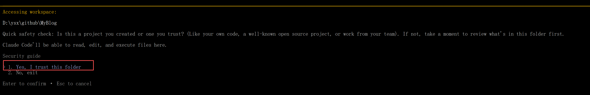
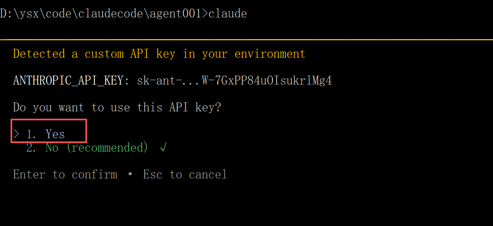
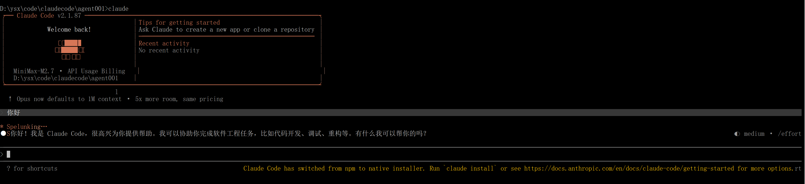

# ClaudeCode 安装指南

AI时代，ClaudeCode是一个非常好用的编码工具，下边主要分享国内windows系统安装ClaudeCode的操作。

## 1. 安装Node.js

依赖npm，先安装Node.js（默认会安装npm）。

```shell
https://nodejs.org/zh-cn/download
https://nodejs.org/dist/v24.14.1/node-v24.14.1-x64.msi
```

查看已安装版本：

```
node -v
npm -v
```


## 2. 安装ClaudeCode

npm安装claude code

```
npm install -g @anthropic-ai/claude-code
```


## 3. 配置大模型

**重要提示**：在配置前，请确保清除以下 Anthropic 相关的环境变量，以免影响 MiniMax API 的正常使用：

- `ANTHROPIC_AUTH_TOKEN`
- `ANTHROPIC_BASE_URL`
- `ANTHROPIC_API_KEY`


以MiniMax为例，配置MiniMax的模型。

套餐订阅参考：https://platform.minimaxi.com/subscribe/token-plan

**通过我的邀请码可以打9折：**

🚀 MiniMax Token Plan 惊喜上线！新增语音、音乐、视频和图片生成权益。邀请好友享双重好礼，助力开发体验！
好友立享 9折 专属优惠 + Builder 权益，你赢返利 + 社区特权！
👉 立即参与：https://platform.minimaxi.com/subscribe/token-plan?code=JDGQc7Yg2r&source=link


### 配置文件

需要手动配置两个配置文件：

- `~/.claude.json` ：用来跳过首次启动引导（第一次启动配置，涉及到国家地区限制等）。在用户目录下的 `.claude.json`，如 `C:\Users\Lenovo\.claude.json`
- `~/.claude/settings.json` ：第三方模型配置等信息。在用户目录下 `.claude/settings.json` (没有则手动创建)，如 `C:\Users\Lenovo\.claude/settings.json`

参考如下：

步骤1： 手动创建文件 `~/.claude.json`，内容参考：

```json
{
  "hasCompletedOnboarding": true
}
```

步骤2： 手动创建文件 `~/.claude/settings.json`，内容参考：

```json
{
  "model": "MiniMax-M2.7",
  "env": {
    "ANTHROPIC_BASE_URL": "https://api.minimaxi.com/anthropic",
    "ANTHROPIC_AUTH_TOKEN": "your-api-key",
    "API_TIMEOUT_MS": "3000000",
    "CLAUDE_CODE_DISABLE_NONESSENTIAL_TRAFFIC": 1,
    "ANTHROPIC_MODEL": "MiniMax-M2.7",
    "ANTHROPIC_SMALL_FAST_MODEL": "MiniMax-M2.7",
    "ANTHROPIC_DEFAULT_SONNET_MODEL": "MiniMax-M2.7",
    "ANTHROPIC_DEFAULT_OPUS_MODEL": "MiniMax-M2.7",
    "ANTHROPIC_DEFAULT_HAIKU_MODEL": "MiniMax-M2.7"
  }
}
```

以MiniMax-M2.7为例：

国内：

```
"ANTHROPIC_BASE_URL": "https://api.minimaxi.com/anthropic"
"ANTHROPIC_AUTH_TOKEN":"申请的MiniMax的api-key"
```

国外：

```
"ANTHROPIC_BASE_URL": "https://api.minimax.io/anthropic"
"ANTHROPIC_AUTH_TOKEN":"申请的MiniMax的api-key"
```


**备注：**

ANTHROPIC_AUTH_TOKEN也可以用ANTHROPIC_API_KEY代替。


### 配置git-bash地址

命令行下使用ClaudeCode，需要依赖于git-bash，在安装完成 [git-bash](https://git-scm.com/) 之后，设置git-bash的环境变量，如：

```
CLAUDE_CODE_GIT_BASH_PATH=C:\software\Git\bin\bash.exe
```


## 4. 验证

选择一个工作目录，打开cmd，执行claude命令。

- 信任当前目录
- 选择使用的api-key
- 输入 "你好" 查看结果

参考截图：










## 升级

使用npm升级

```
npm update -g @anthropic-ai/claude-code
```

查看版本：

```
claude --version
```


## 5. 卸载


步骤1：卸载npm包

```
npm uninstall -g @anthropic-ai/claude-code
```

步骤2：删除配置文件（可选）

- `~/.claude.json` 
- `~/.claude` 

步骤3：删除相关环境变量（如果有）

- `ANTHROPIC_AUTH_TOKEN`
- `ANTHROPIC_BASE_URL`
- `ANTHROPIC_API_KEY`

步骤4：验证卸载：

```
claude --version
```


## 参考

- [MiniMax-在 AI 编程工具里使用 M2.7](https://platform.minimaxi.com/docs/token-plan/claude-code#windows)

- MiniMax 套餐：**通过我的邀请码可以打9折：**

  🚀 MiniMax Token Plan 惊喜上线！新增语音、音乐、视频和图片生成权益。邀请好友享双重好礼，助力开发体验！
  好友立享 9折 专属优惠 + Builder 权益，你赢返利 + 社区特权！
  👉 立即参与：https://platform.minimaxi.com/subscribe/token-plan?code=JDGQc7Yg2r&source=link
