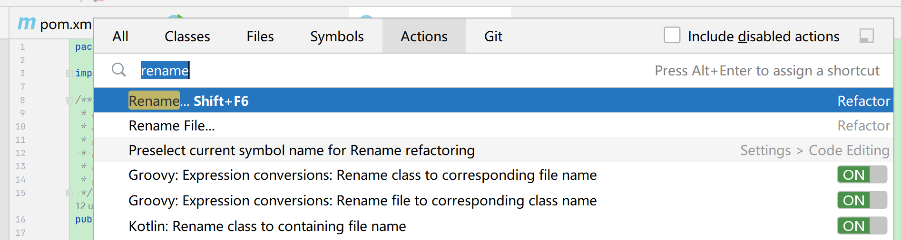

# IDEA 常用快捷键

## 编辑

| 快捷键     | 含义             |
| ---------- | ---------------- |
| Ctrl+Space | 代码提示         |
| Alt+Insert | 生成代码         |
| Ctrl+Alt+L | 格式化代码       |
| Ctrl+Alt+O | 优化导入的类和包 |
|            |                  |

## 浏览

| 快捷键              | 含义                        |
| ------------------- | --------------------------- |
| Ctrl+N              | 查找类                      |
| Ctrl+Shift+N        | 查找文件                    |
| Ctrl+Alt+Left/Right | 回退/前进到上一个操作的地方 |
| Ctrl+H              | 显示类结构图                |
| Ctrl+Shift+H        | 方法层次结构                |
| Ctrl+Alt+H          | 调用层次                    |
|                     |                             |

## 重构相关

| 快捷键           | 含义                                     |
| ---------------- | ---------------------------------------- |
| Ctrl+Alt+Shift+T | 三键齐发 提示所有重构方法                |
| Ctrl+Alt+N       | 内联                                     |
| Ctrl+Alt+M       | 提取函数                                 |
| F6               | 移动函数（需要先修改为static才可以移动） |
| F2               | 高亮错误或者告警快速定位                 |
| Alt+Delete       | 安全删除                                 |
| Shift+F6         | 重命名                                   |
| Alt+Enter        | 提示可以的操作                           |

## 查看快捷键

使用 Ctrl+Shift+A，输入相关操作，查看IDEA自带的快捷键。

