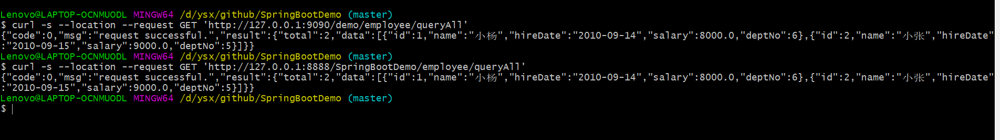

# nginx 基础

[TOC]

默认情况下，Nginx被安装在目录 `usr/local/nginx/` 中。其中二进制文件的路径为`usr/local/nginx/sbin/nginx`，配置文件路径为 `usr/local/nginx/conf/nginx.conf`。


Nginx使用一个master进程来管理多个work进程。一般情况下，worker进程的数量与服务器上的CPU核心数相等：

- 每一个worker进程用用来提供互联网服务。
- master进程用来管理worker进程。

## 1. 常用命令：

```shell
# 测试配置信息是否有错误
nginx -t
# 使运行的nginx重读配置项并生效
nginx -s reload
# 显示版本信息
nginx -v
# 显示编译阶段的参数
nginx -V
# 快速停止服务,-s表示向正在运行的Nginx服务发送信号量
nginx -s stop
```


**windows下操作nginx：**

```shell
# 启动
start nginx
# 查看nginx的进程
tasklist /fi "imagename eq nginx.exe"
# 立即关闭（fast shutdown）
nginx -s stop
# 优雅地关闭（graceful shutdown）
nginx -s quit
# 重载使配置生效
nginx -s reload
# 重新打开日志文件（re-opening log files）
nginx -s reopen
```


## 2. 配置 conf/nginx.conf


### 2.1 修改端口

```yaml
# 修改端口为9090(省略其他配置)
    server {
        listen       9090;
        server_name  localhost;
```


### 2.2 反向代理


```yaml
# 将demo的请求，转发到http://localhost:8888/SpringBootDemo    
        location /demo {
            proxy_pass  http://localhost:8888/SpringBootDemo;
        }
```

如，请求http://192.168.3.141:9090/demo/employee/queryAll，实际转发请求为：http://127.0.0.1:8888/SpringBootDemo/employee/queryAll。




# todo

1. location 的匹配规则。
2. proxy使用https，证书相关配置。
