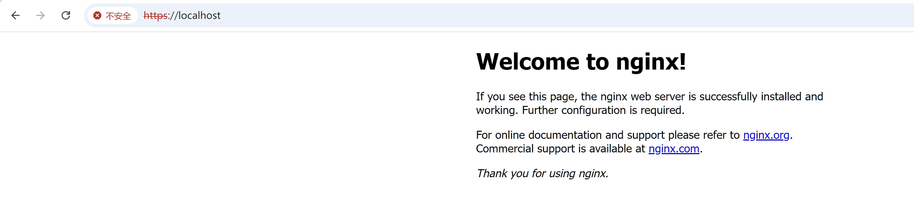
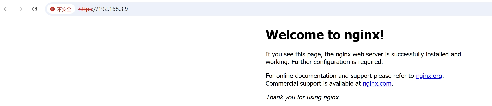
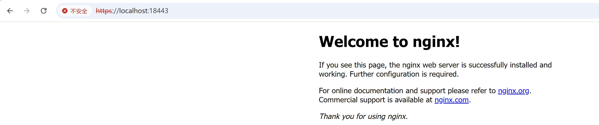
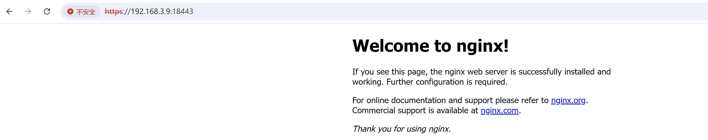
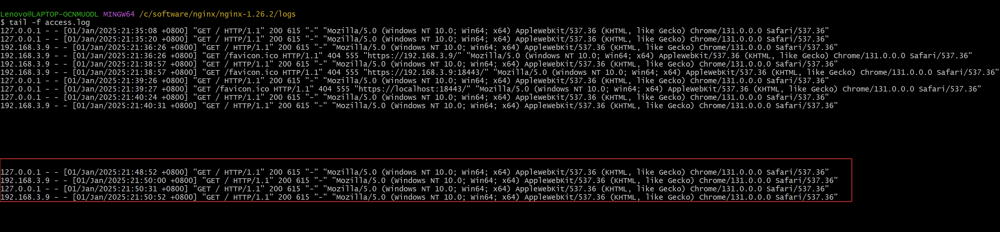

# nginx配置https服务器


## 1. 生成证书

在linux系统下执行，使用openssl命令。（windows环境也可以使用cmder）

```shell
# 1. 生成私钥 server2025.key(无密码保护)
openssl genpkey -algorithm RSA -pkeyopt rsa_keygen_bits:4096 -out server2025.key
# 2. 生成证书签名请求文件 server2025.csr
openssl req -new -key server2025.key -out server2025.csr -subj "/C=CN/O=demo/CN=server2025.demo.com"
# 3. 使用整数签名请求文件和私钥文件生成签名证书 server2025.crt
openssl x509 -req -in server2025.csr -signkey server2025.key -out server2025.crt -days 3650 -sha256
# 使用私钥文件server2025.key和证书文件server2025.crt，作为nginx的https的配置证书。
```


## 2. 配置证书

### 1. 拷贝证书文件

将私钥文件server2025.key和证书文件server2025.crt，分别拷贝到conf/cert/目录下。

### 2. 修改conf/nginx.conf文件内容

```shell
# 忽略其他配置
    server {
        listen       443 ssl;
        server_name  localhost;

        ssl_certificate      cert/server2025.crt;
        ssl_certificate_key  cert/server2025.key;

        ssl_session_cache    shared:SSL:1m;
        ssl_session_timeout  5m;

        ssl_ciphers  HIGH:!aNULL:!MD5;
        ssl_prefer_server_ciphers  on;

        location / {
            root   html;
            index  index.html index.htm;
        }
    }
```


## 3. 查看效果

### 1. 重载配置

```shell
# 1. 先测试配置是否ok
nginx -t
# 2. 重载配置
nginx -s reload
```

### 2. 访问

浏览器访问：(其中192.168.3.9为本地的ipv4地址)

- https://localhost
- https://192.168.3.9
- https://localhost:18443
- https://192.168.3.9:18443


可以修改端口为18443后再验证：

```shell
    server {
        listen       18443 ssl;
        server_name  localhost;

        ssl_certificate      cert/server2025.crt;
        ssl_certificate_key  cert/server2025.key;

        ssl_session_cache    shared:SSL:1m;
        ssl_session_timeout  5m;

        ssl_ciphers  HIGH:!aNULL:!MD5;
        ssl_prefer_server_ciphers  on;

        location / {
            root   html;
            index  index.html index.htm;
        }
    }
```


https://localhost




https://192.168.3.9




https://localhost:18443




https://192.168.3.9:18443




查看访问日志：

tail -f logs/access.log

```shell
127.0.0.1 - - [01/Jan/2025:21:48:52 +0800] "GET / HTTP/1.1" 200 615 "-" "Mozilla/5.0 (Windows NT 10.0; Win64; x64) AppleWebKit/537.36 (KHTML, like Gecko) Chrome/131.0.0.0 Safari/537.36"
192.168.3.9 - - [01/Jan/2025:21:50:00 +0800] "GET / HTTP/1.1" 200 615 "-" "Mozilla/5.0 (Windows NT 10.0; Win64; x64) AppleWebKit/537.36 (KHTML, like Gecko) Chrome/131.0.0.0 Safari/537.36"
127.0.0.1 - - [01/Jan/2025:21:50:31 +0800] "GET / HTTP/1.1" 200 615 "-" "Mozilla/5.0 (Windows NT 10.0; Win64; x64) AppleWebKit/537.36 (KHTML, like Gecko) Chrome/131.0.0.0 Safari/537.36"
192.168.3.9 - - [01/Jan/2025:21:50:52 +0800] "GET / HTTP/1.1" 200 615 "-" "Mozilla/5.0 (Windows NT 10.0; Win64; x64) AppleWebKit/537.36 (KHTML, like Gecko) Chrome/131.0.0.0 Safari/537.36"
```

