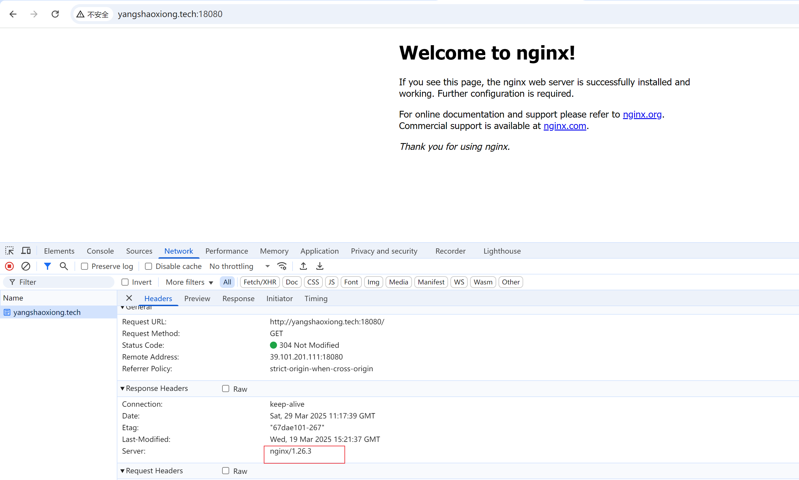
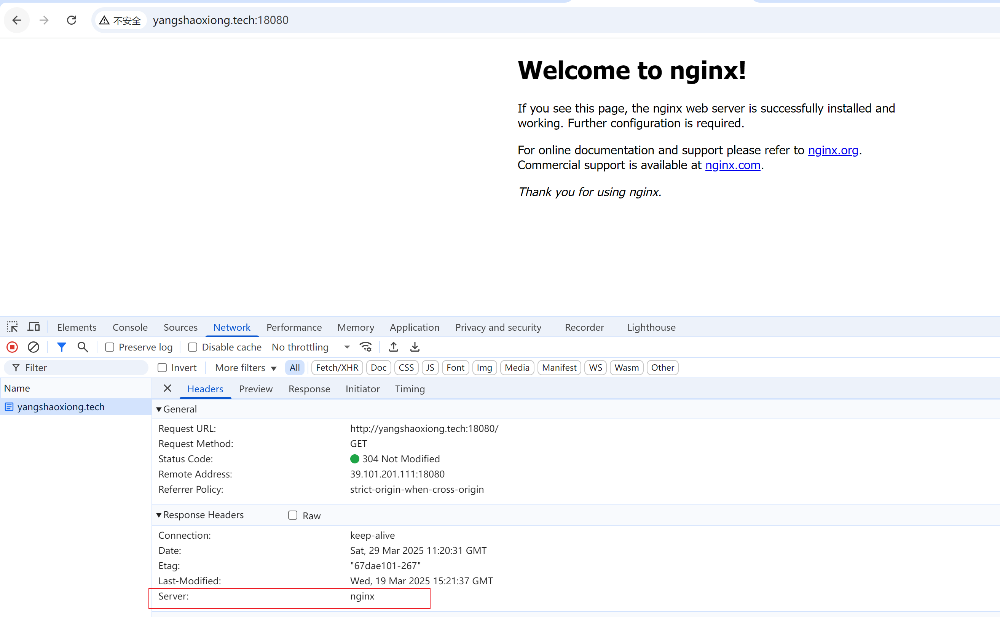

# nginx 设置隐藏版本号

Nginx默认会在Server头里包含版本信息，比如“nginx/1.18.0”，这可能存在安全隐患，因为攻击者知道了版本号后，可以针对特定版本的漏洞进行攻击。所以，隐藏版本号是一个常见的安全措施。

可通过在http块里加上server_tokens off; 关闭nginx的版本显示。


```shell
http {
    # 省略其他配置
    server_tokens off;
}
```


重载nginx让配置生效：

```shell
nginx -s reload
```


修改前：




修改后：



