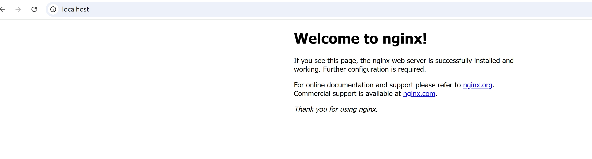

# windows系统安装nginx


## 1. 下载

官方下载地址：https://nginx.org/en/download.html

可以下载windows版本，如nginx-1.26.2.zip。解压后，加入系统变量。

 ## 2. 启动

可以使用命令行启动（windows系统自带的cmd可能会有问题，建议使用[cmder](https://github.com/cmderdev/cmder))。

相关命令：

```shell
# 查看版本号
nginx -v
# 启动
start nginx
# windows下查看nginx进程
tasklist /fi "imagename eq nginx.exe"
# 根据进程id杀死进程
taskkill /F /IM <进程id>
# 快速停止
nginx -s stop
# 优雅停止
nginx -s quit
# 重新加载配置
nginx -s reload
# 测试配置是否有误
nginx -t

```


配置文件：

conf/nginx.conf

日志目录：

logs/access.log

logs/error.log


## 3. 验证

使用来浏览器访问：

http://localhost




访问日志：

```shell
127.0.0.1 - - [01/Jan/2025:08:03:06 +0800] "GET /favicon.ico HTTP/1.1" 404 555 "http://localhost/" "Mozilla/5.0 (Windows NT 10.0; Win64; x64) AppleWebKit/537.36 (KHTML, like Gecko) Chrome/131.0.0.0 Safari/537.36"
```


## 参考文档

- [nginx-windows官方文档](https://nginx.org/en/docs/windows.html)