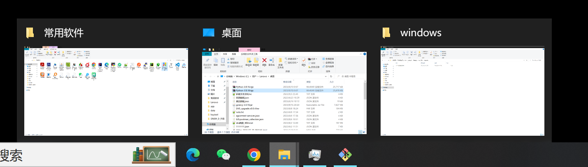
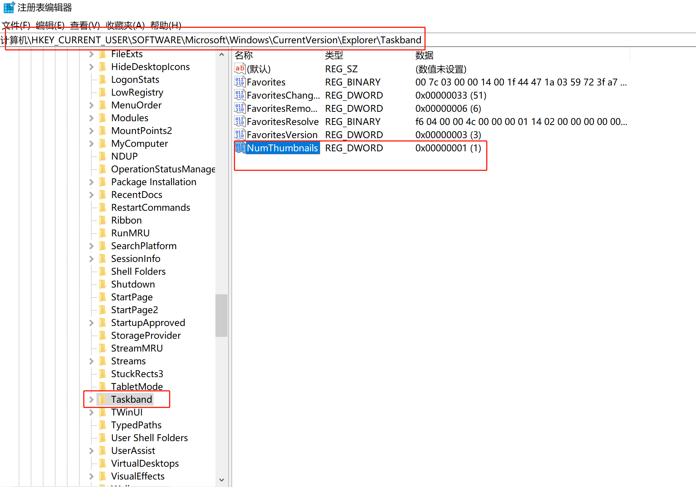
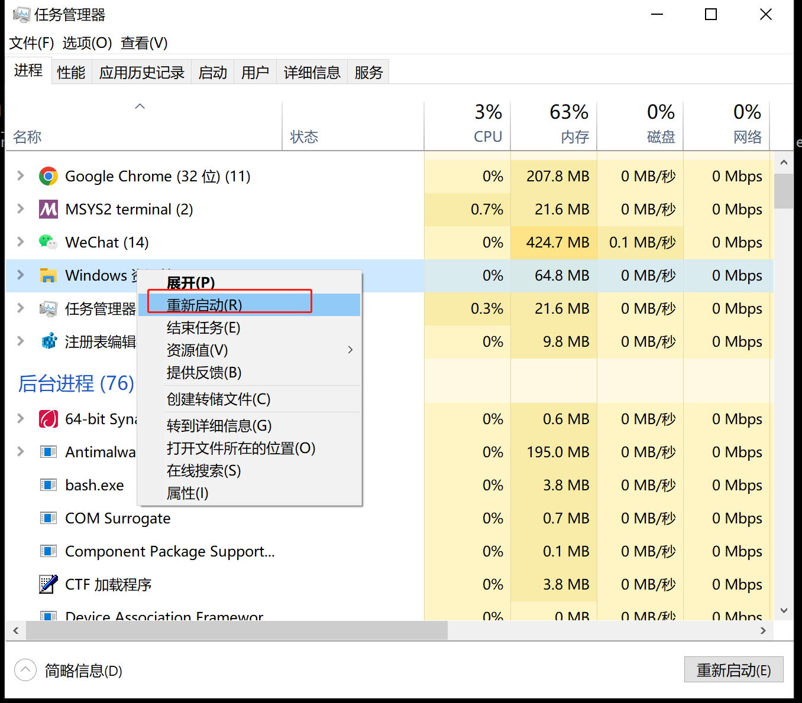
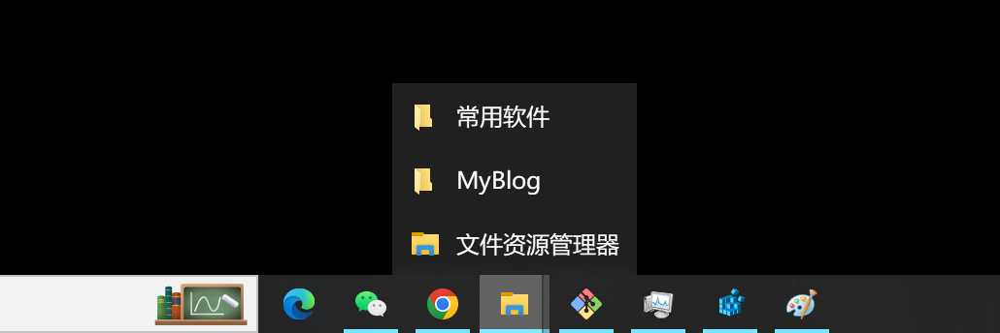

# win10 任务栏预览设置为列表效果


## 背景

在win10系统，当同一个应用（如文件资源管理器，git bash，word等）打开多个页面时，当个数少于17（大约）个时，其默认预览效果为平铺，在大于17个时，才使用列表效果，如下图所示。使用平铺效果选择页面比较困难。





## 方法

打开注册表，设置使用列表预览方式的阈值为1。

**步骤1**


打开注册表，进入 计算机\HKEY_CURRENT_USER\SOFTWARE\Microsoft\Windows\CurrentVersion\Explorer\Taskband ，新建变量名为 **NumThumbnails** ,将其值设置为1。

```
计算机\HKEY_CURRENT_USER\SOFTWARE\Microsoft\Windows\CurrentVersion\Explorer\Taskband
```

参考截图




**步骤2**

重启文件资源管理器




## 效果对比


修改后效果如下：




## 参考

https://www.addictivetips.com/windows-tips/replace-taskbar-previews-list-view-on-windows-10/


